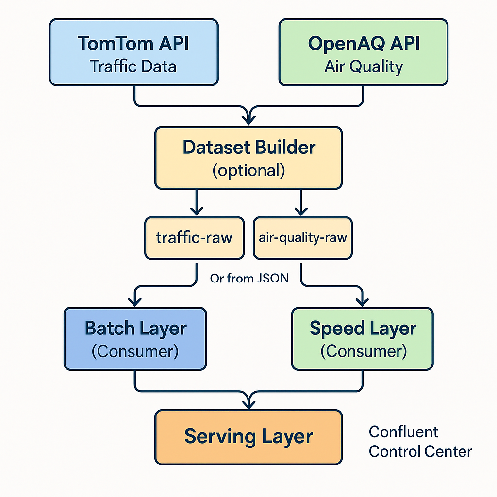
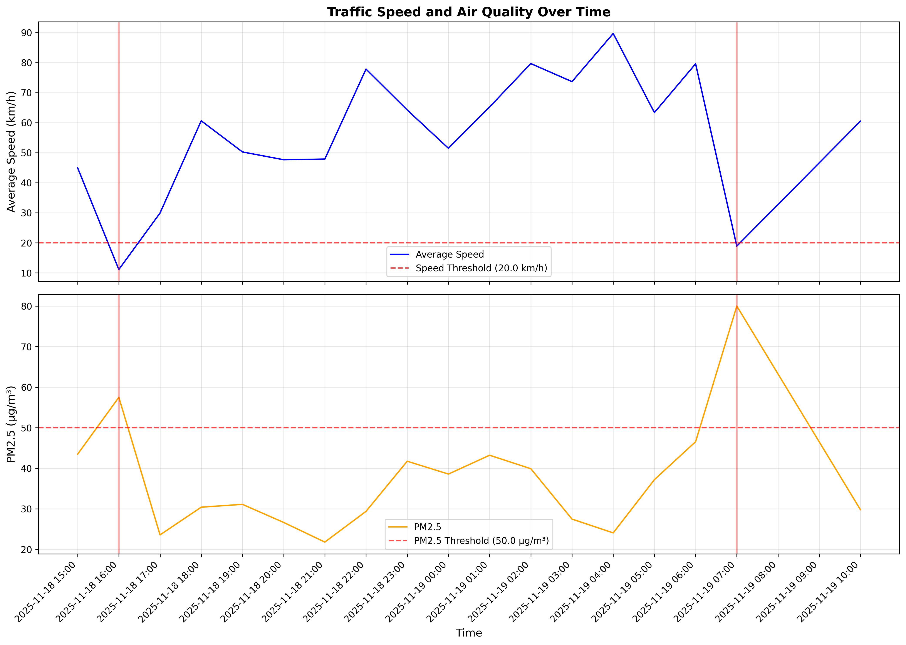
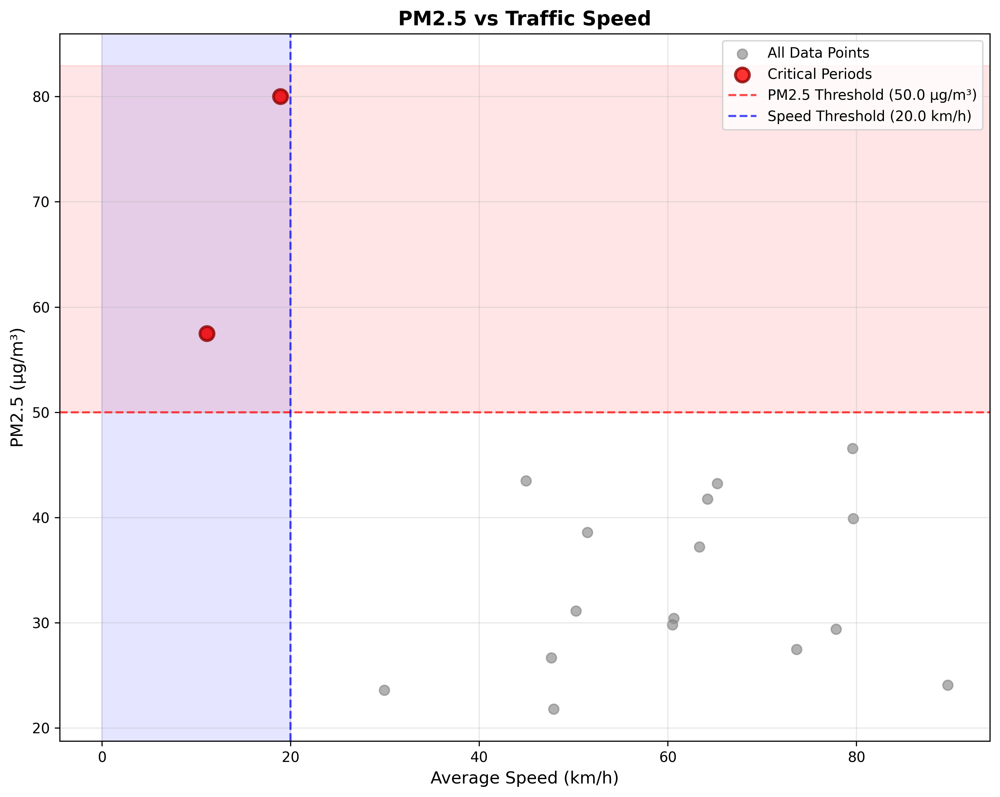
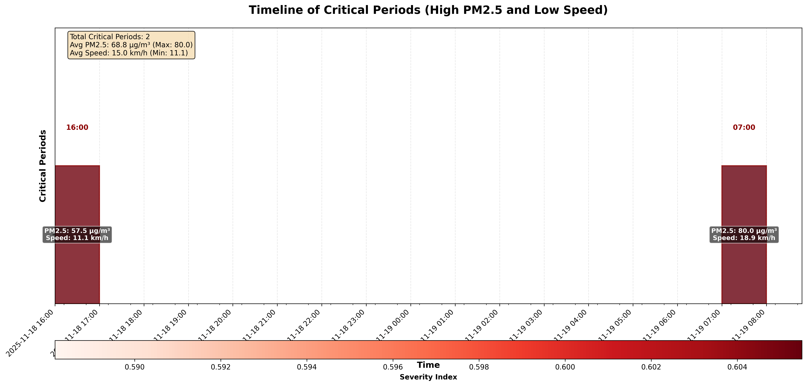

# Lambda Architecture Prototype for HCMC Smart City IoT Data

A Python prototype implementing a Lambda Architecture for processing real-time traffic data and real-time air quality measurements in Ho Chi Minh City (HCMC), Vietnam. This project demonstrates how batch and speed layers can be combined to identify critical periods with both high traffic congestion and poor air quality.

## Project Overview

This project is part of a Master's course on "New Trends in ICT" and demonstrates:

- **Batch Layer**: Processing historical traffic flow data from HCMC
- **Speed Layer**: Collecting near real-time air quality (PM2.5) data via OpenAQ API
- **Serving Layer**: Combining both datasets to identify critical periods where traffic congestion and air pollution coincide

<p align="center">
  
</p>

### Use Case

**Low-Emission Traffic Management in Ho Chi Minh City**

City decision-makers can use this system to identify when and where:
- Traffic congestion is severe (low average speed), **and**
- Air quality is poor (high PM2.5 levels)

This information supports:
- Dynamic traffic management policies
- Public health advisories
- Long-term infrastructure planning

## Project Structure

```
Project/
├── README.md
├── requirements.txt
├── config.py                    # Configuration settings
├── dataset_builder.py           # Helpers for dataset generation
├── main.py                      # Main entry point / CLI
├── batch_layer/
│   ├── __init__.py
│   └── batch_processor.py      # Process historical traffic data
├── speed_layer/
│   ├── __init__.py
│   └── speed_processor.py      # Process air quality data
├── serving_layer/
│   ├── __init__.py
│   └── data_integrator.py      # Combine batch + speed data
├── utils/
│   ├── __init__.py
│   ├── data_loader.py           # Common data loading utilities
│   └── visualizer.py            # Plotting functions
└── data/
    ├── raw/                     # Raw dataset cache (traffic_raw.json, air_raw.json)
    ├── batch_views/             # Processed batch layer outputs
    ├── speed_views/             # Speed layer outputs
    └── serving_views/           # Final combined outputs
```

## Setup Instructions

### 1. Prerequisites

- Python 3.8 or higher
- Package manager: `pip` (standard) or `uv` (recommended for faster installation)
- Docker and Docker Compose (required for Kafka integration, optional otherwise)

### 2. Install Dependencies

#### Option A: Using pip (Standard)

```bash
pip install -r requirements.txt
```

#### Option B: Using uv (Faster Alternative)

[uv](https://github.com/astral-sh/uv) is a fast Python package installer and resolver written in Rust.

**Install uv:**
```bash
# On Windows (PowerShell)
powershell -ExecutionPolicy ByPass -c "irm https://astral.sh/uv/install.ps1 | iex"

# On macOS/Linux
curl -LsSf https://astral.sh/uv/install.sh | sh
```

**Install dependencies:**
```bash
uv sync  # Installs dependencies from pyproject.toml
uv run python main.py dataset --use-api both
```

**Run commands with uv:**
```bash
# All commands work the same, just prefix with 'uv run'
uv run python main.py dataset --use-api both
uv run python main.py full
uv run python main.py batch
```

Alternatively, if you have no `pyproject.toml` configured:
```bash
uv pip install -r requirements.txt
```

### 3. API Keys

The project now collects data directly from the APIs and focuses on **District 10** in Ho Chi Minh City.

| API      | Purpose                  | Key required? | Notes |
|----------|--------------------------|---------------|-------|
| TomTom Traffic Flow | Live traffic speeds (snapshot/collector) | ✅ | Sign up at [TomTom Developer](https://developer.tomtom.com/) and set `TOMTOM_API_KEY`. |
| OpenAQ Measurements | PM2.5 for the last 24h | ✅ | Create an account at [OpenAQ](https://openaq.org/) and set `OPENAQ_API_KEY`. |

Set the keys via environment variables or update `config.py` directly (not recommended for production).

### 3.5. Kafka Setup (Optional)

For Kafka integration, you need to start the Kafka infrastructure using Docker Compose:

```bash
# Start Kafka, Zookeeper, and Confluent Control Center
docker-compose up -d

# Check status
docker-compose ps

# Access Confluent Control Center UI
# Open http://localhost:9021 in your browser
```

**Stopping Kafka:**
```bash
docker-compose down
```

**Note:** Kafka integration is optional. The system works perfectly fine with JSON files (default behavior). Use `--use-kafka` flag only when you want to use Kafka topics.

### 4. Build Local Datasets

Use the new **dataset** command to capture raw JSON datasets for analytics or offline runs:

```bash
# Fetch current traffic snapshot (District 10) and last 24h air quality
python main.py dataset --use-api both

# Run a 24h traffic collector (requests every 30 minutes)
python main.py dataset --use-api traffic --collector --interval 30 --duration 24

# Only refresh air dataset (last 12 hours)
python main.py dataset --use-api air --hours 12
```

This command writes the following raw JSON files (or Kafka topics if `--use-kafka` is used):

- `data/raw/traffic_raw.json` – snapshots/collector output (raw TomTom responses with metadata)
- `data/raw/air_raw.json` – latest PM2.5 measurements from OpenAQ

These files become the default inputs for the batch and speed layers when `--use-api` is **not** provided. The processing steps convert the raw JSON into the CSV views used by the serving layer.

### 4.5 Build Local Datasets using Kafka

**Option A: Fetch from API and write to Kafka**
```bash
# Creates dataset from API into Kafka instead of JSON files
python main.py dataset --use-api both --use-kafka
```

**Option B: Load existing JSON files into Kafka**
```bash
# Load existing JSON files into Kafka (no API calls)
python main.py dataset --use-api air --use-kafka --from-file
python main.py dataset --use-api traffic --use-kafka --from-file
python main.py dataset --use-api both --use-kafka --from-file
```

> **Note:** Legacy CSV ingestion has been removed. Always refresh the JSON datasets with `python main.py dataset ...` before running the batch or speed layers in offline mode.

## Usage

### Command-Line Interface

#### 1. Dataset Builder

```bash
# Snapshot both datasets
python main.py dataset

# Only traffic collector (every 15 minutes for 6 hours)
python main.py dataset --use-api traffic --collector --interval 15 --duration 6

# Only air quality (last 12 hours)
python main.py dataset --use-api air --hours 12
```

#### 2. Run Full Pipeline

Process all layers in sequence using the locally cached raw datasets:

```bash
python main.py full
```

Use live APIs instead of local datasets (raw JSON files are still refreshed first unless `--no-api` is provided):

```bash
python main.py full --use-api both
```

Skip dataset creation and reuse existing raw files:

```bash
python main.py full --no-api
```

**Using Kafka (requires Docker Compose):**

```bash
# Start Kafka first
docker-compose up -d

# Write datasets to Kafka and process from Kafka
python main.py full --use-api both --use-kafka

# Process from Kafka (skip dataset creation)
python main.py full --no-api --use-kafka
```

#### 3. Run Individual Layers

- **Batch layer:** `python main.py batch [--use-api] [--use-kafka] [--traffic-file path/to/traffic_raw.json]`
- **Speed layer:** `python main.py speed [--use-api] [--use-kafka] [--air-file path/to/air_raw.json] [--continuous --interval 10]`
- **Serving layer:** `python main.py serving [--no-plots]`

**Data Source Priority:**
- Without flags: Reads from JSON files (`data/raw/traffic_raw.json`, `data/raw/air_raw.json`)
- With `--use-api`: Fetches fresh data from APIs
- With `--use-kafka`: Reads from Kafka topics (requires Kafka running)

**Kafka Examples:**
```bash
# Batch layer from Kafka
python main.py batch --use-kafka

# Speed layer from Kafka
python main.py speed --use-kafka

# Continuous speed layer from Kafka
python main.py speed --use-kafka --continuous --interval 5
```

### Programmatic Usage

You can also import and use the modules directly:

```python
from batch_layer.batch_processor import run_batch_processing
from speed_layer.speed_processor import collect_air_quality_once
from serving_layer.data_integrator import run_serving_layer

# Process batch layer
batch_df = run_batch_processing()

# Collect air quality data (from API or raw JSON)
air_quality_df = collect_air_quality_once(use_api=True)

# Integrate and analyze
combined_df, critical_df, stats = run_serving_layer()
```

## Output Files

After running the pipeline, you'll find the following outputs:

### Batch Layer Outputs
- `data/batch_views/traffic_batch_view.csv`: Hourly aggregated traffic metrics
  - Columns: `timestamp`, `avg_speed`, `min_speed`, `max_speed`, `record_count`, `road_segment_id` (if available)

### Speed Layer Outputs
- `data/speed_views/air_speed_layer_append.csv`: Time-series of PM2.5 measurements
  - Columns: `timestamp`, `location`, `pm25`, `latitude`, `longitude`

### Serving Layer Outputs
- `data/serving_views/combined_view.csv`: Merged batch + speed data
  - Columns: All batch columns + `avg_pm25`, `pm25_count`, `location_count`, `is_critical`, `severity_index`

- `data/serving_views/critical_periods.csv`: Filtered periods meeting threshold criteria
  - Only records where `avg_pm25 > 50 µg/m³` AND `avg_speed < 20 km/h`

- `data/serving_views/plots/`:
  - `time_series.png`: Time series plot of speed and PM2.5
  - `scatter_plot.png`: Scatter plot of PM2.5 vs speed
  - `critical_periods_timeline.png`: Timeline visualization of critical periods

## Visualizations

The serving layer generates three types of visualizations to help analyze critical periods:

### Time Series Plot



The time series plot displays traffic speed and PM2.5 air quality measurements over time. Critical periods are highlighted with vertical red lines, showing when both conditions (low speed and high PM2.5) are met simultaneously.

### Scatter Plot



The scatter plot shows the relationship between PM2.5 concentration and average traffic speed. The plot is divided into four regions by threshold lines:
- **Critical Periods** (top-left, purple): High PM2.5 (>50 µg/m³) AND low speed (<20 km/h)
- **High PM2.5, Normal Speed** (top-right, red): High PM2.5 but speed above threshold
- **Low Speed, Good Air Quality** (bottom-left, blue): Low speed but PM2.5 below threshold
- **Normal Conditions** (bottom-right): Both metrics within acceptable ranges

### Critical Periods Timeline



The timeline visualization provides a detailed view of identified critical periods, showing:
- Start times of each critical period
- PM2.5 and speed values for each period
- Severity index (color-coded gradient)
- Summary statistics (total periods, average PM2.5, average speed)

## Configuration

Key settings can be modified in `config.py`:

- **Thresholds:**
  - `PM25_THRESHOLD = 50.0` (µg/m³)
  - `SPEED_THRESHOLD = 20.0` (km/h)

- **API Settings (District 10 focus):**
  - `DISTRICT10_CENTER_LAT = 10.7715`
  - `DISTRICT10_CENTER_LON = 106.6664`
  - `DISTRICT10_RADIUS_KM = 3`
  - `DISTRICT10_LAT_MIN/LAT_MAX/LON_MIN/LON_MAX` define the TomTom grid.

- **Polling:**
  - `POLLING_INTERVAL_MINUTES = 5`
  - `MAX_RETRIES = 3`

## Data Format Specifications

### Traffic Raw Dataset Format

`data/raw/traffic_raw.json` contains the raw TomTom Flow API responses (with an additional `_fetched_at` timestamp). The batch processor parses these responses into structured rows with:

- `timestamp` (HCMC local time derived from `_fetched_at`)
- `segment_id` (generated from the response coordinates)
- `velocity` (km/h, converted from m/s)

### Air Quality Raw Dataset Format

`data/raw/air_raw.json` stores the measurement dictionaries returned by the OpenAQ SDK. The speed processor converts them into:

- `timestamp` (derived from `datetimeFrom.local` field for consistent hour assignment)
- `location`
- `pm25`
- `latitude`
- `longitude`

## Architecture Overview

### Lambda Architecture Components

1. **Batch Layer**
   - Processes historical traffic data offline
   - Reads from Kafka topics (with `--use-kafka`) or JSON files (default)
   - Aggregates by hour (and optionally by road segment)
   - Generates batch views for long-term analysis

2. **Speed Layer**
   - Collects near real-time air quality data
   - Reads from Kafka topics (with `--use-kafka`), polls OpenAQ API, or loads from JSON files
   - Maintains a recent view of environmental conditions

3. **Serving Layer**
   - Merges batch and speed views on timestamp
   - Identifies critical periods based on thresholds
   - Generates visualizations and summary statistics

### Kafka Integration

The system supports **optional Kafka integration** for a production-like Lambda Architecture:

- **Immutable Data Stream**: All incoming data is written to Kafka topics (`traffic-raw`, `air-quality-raw`)
- **Batch Layer**: Reads from Kafka using consumer group `lambda-batch-consumer`
- **Speed Layer**: Reads from Kafka using consumer group `lambda-speed-consumer`
- **Backward Compatible**: Without `--use-kafka`, the system works with JSON files (default behavior)

**Benefits:**
- True Lambda Architecture pattern (immutable data stream)
- Scalable and production-ready
- Visual monitoring via Confluent Control Center UI
- Consumer group management for parallel processing

### Architecture Diagram

```
┌─────────────────┐         ┌─────────────────┐
│   TomTom API    │         │   OpenAQ API    │
│  (Traffic Data) │         │ (Air Quality)   │
└────────┬────────┘         └────────┬────────┘
         │                            │
         │                            │
         ▼                            ▼
┌─────────────────────────────────────────────┐
│         Dataset Builder                     │
│  (Fetches & Writes to Kafka or JSON)       │
└────────┬────────────────────────────────────┘
         │
         │
         ▼
┌─────────────────────────────────────────────┐
│              Kafka Topics                     │
│  ┌──────────────┐    ┌──────────────┐      │
│  │ traffic-raw  │    │air-quality-raw│     │
│  └──────────────┘    └──────────────┘      │
│         │                    │              │
│         │                    │              │
│         └────────┬───────────┘              │
│                  │                          │
│         ┌────────▼──────────┐               │
│         │ Confluent Control │               │
│         │   Center (UI)     │               │
│         │  localhost:9021   │               │
│         └───────────────────┘               │
└─────────────────────────────────────────────┘
         │                    │
         │                    │
         ▼                    ▼
┌─────────────────┐    ┌─────────────────┐
│  Batch Layer    │    │  Speed Layer     │
│  (Consumer)     │    │  (Consumer)     │
│                 │    │                 │
│ - Aggregates    │    │ - Real-time     │
│   by hour       │    │   processing    │
│ - Historical    │    │ - Recent data   │
│   analysis      │    │                 │
└────────┬────────┘    └────────┬────────┘
         │                       │
         │                       │
         └───────────┬───────────┘
                     │
                     ▼
         ┌───────────────────────┐
         │   Serving Layer       │
         │                       │
         │ - Merges batch + speed│
         │ - Identifies critical │
         │   periods             │
         │ - Generates plots     │
         └───────────────────────┘
```

**Data Flow:**
1. **Data Sources**: TomTom API (traffic) and OpenAQ API (air quality)
2. **Dataset Builder**: Fetches data and writes to Kafka topics (with `--use-kafka`) or JSON files (default)
3. **Kafka Topics**: Immutable data stream (`traffic-raw`, `air-quality-raw`)
4. **Batch Layer**: Reads from Kafka/JSON, processes historical data, creates hourly aggregations
5. **Speed Layer**: Reads from Kafka/JSON, processes recent data in near real-time
6. **Serving Layer**: Combines both views to identify critical periods

**Confluent Control Center**: Web UI at http://localhost:9021 for monitoring topics, messages, and consumer groups.

### Conceptual Edge/Fog/Cloud Architecture

While the implementation runs on a single machine, the design conceptually maps to:

- **Edge Layer**: Physical sensors (traffic sensors, air quality stations)
- **Fog Layer**: Local gateways performing preprocessing/aggregation
- **Cloud Layer**: Big Data platform running batch and speed processing

## Troubleshooting

### Common Issues

**1. "No traffic data file found"**
- Ensure `traffic_raw.json` exists in `data/raw/`
- Verify it contains valid JSON (rerun `python main.py dataset --use-api traffic` if needed)
- Check file permissions

**2. "No air quality data collected"**
- Check internet connection and API keys
- Verify OpenAQ API is accessible
- Rebuild the raw dataset via `python main.py dataset --use-api air`
- Some locations may have limited air quality stations

**3. "No critical periods found"**
- This is normal if thresholds are not met
- Try adjusting thresholds in `config.py`
- Ensure both traffic and air quality data exist for overlapping time periods

**4. Import errors**
- Ensure all dependencies are installed: `pip install -r requirements.txt`
- Check that you're running from the project root directory

**5. Kafka connection errors**
- Ensure Kafka is running: `docker-compose ps`
- Start Kafka if needed: `docker-compose up -d`
- Check Kafka is accessible: `docker-compose logs broker`
- Verify Control Center UI is accessible: http://localhost:9021
- If using custom Kafka servers, set `KAFKA_BOOTSTRAP_SERVERS` environment variable

## Evaluation and Analysis

The project evaluation focuses on:

1. **Latency/Freshness**: How quickly speed-layer data reflects changes (depends on polling interval)
2. **Scalability**: Conceptual discussion of scaling to distributed systems (Kafka, Spark, etc.)
3. **Complexity**: Trade-offs between Lambda Architecture vs. pure batch or pure streaming
4. **Usefulness**: Whether combining traffic and air quality data provides actionable insights

## Kafka Integration

### Overview

The system supports optional Kafka integration for a production-ready Lambda Architecture. Kafka provides an immutable data stream that both batch and speed layers can read from independently.

### Quick Start with Kafka

1. **Start Kafka infrastructure:**
   ```bash
   docker-compose up -d
   ```

2. **Write datasets to Kafka:**
   ```bash
   python main.py dataset --use-api both --use-kafka
   ```

3. **Process pipeline from Kafka:**
   ```bash
   python main.py full --use-kafka --no-api
   ```

4. **Monitor in Control Center UI:**
   - Open http://localhost:9021
   - View topics: `traffic-raw`, `air-quality-raw`
   - Monitor consumer groups: `lambda-batch-consumer`, `lambda-speed-consumer`

### Kafka Topics

- **`traffic-raw`**: Raw traffic data from TomTom API
- **`air-quality-raw`**: Raw air quality measurements from OpenAQ

### Consumer Groups

- **`lambda-batch-consumer`**: Batch layer reads from Kafka using this consumer group
- **`lambda-speed-consumer`**: Speed layer reads from Kafka using this consumer group

### Configuration

Kafka settings can be configured via environment variables or `config.py`:

- `KAFKA_BOOTSTRAP_SERVERS` (default: `localhost:9092`)
- `KAFKA_TRAFFIC_TOPIC` (default: `traffic-raw`)
- `KAFKA_AIR_QUALITY_TOPIC` (default: `air-quality-raw`)
- `KAFKA_BATCH_CONSUMER_GROUP` (default: `lambda-batch-consumer`)
- `KAFKA_SPEED_CONSUMER_GROUP` (default: `lambda-speed-consumer`)

### Backward Compatibility

**Important:** The system is fully backward compatible. Without the `--use-kafka` flag, everything works exactly as before with JSON files. Kafka is completely optional.

## Future Enhancements

Potential improvements for a production system:

- Real-time streaming with Spark Streaming (reading from Kafka)
- Distributed batch processing with Spark/Hadoop
- Machine learning models for prediction
- Real-time dashboard with web interface
- Database storage instead of CSV files
- More sophisticated aggregation and windowing

## License

This project is created for academic purposes as part of a Master's course assignment.

## References

- **OpenAQ API**: https://openaq.org/
- **Lambda Architecture**: Nathan Marz and James Warren, "Big Data: Principles and best practices of scalable real-time data systems"

## Contact

For questions or issues related to this prototype, please refer to the course instructor or project documentation.

